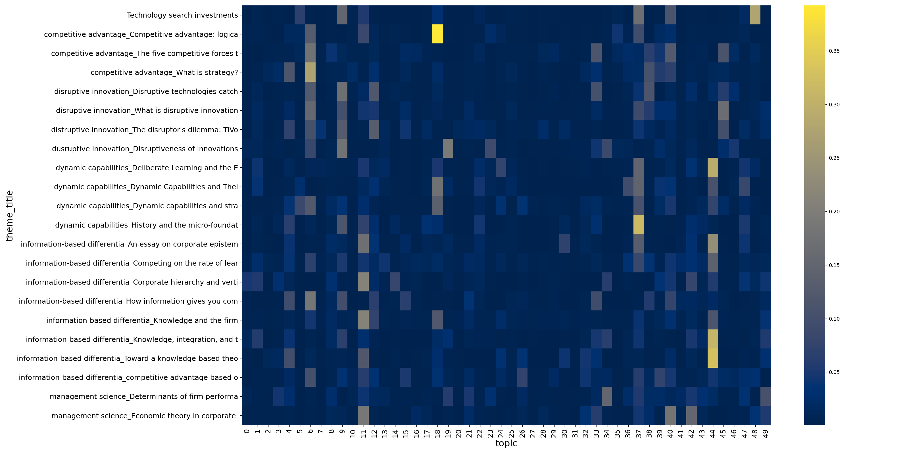
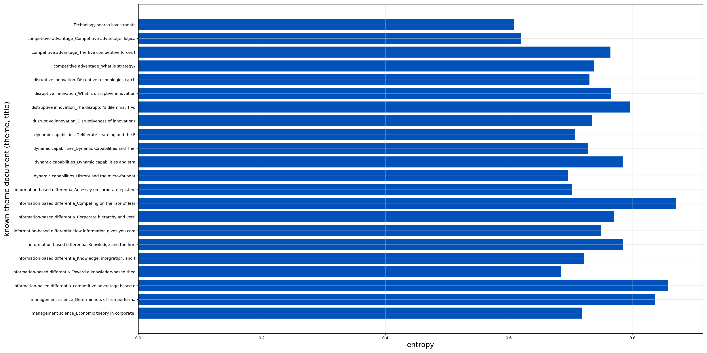

# A natural-language-processing exploration of the thematic landscape of the field of *Business Strategy*, 1980-2020.

December 30, 2020

## Abstract.

A novel combination of Natural-Language Processing (NLP) and Machine-Learning (ML) techniques provides some ability to discriminate between known-theme documents in a corpus comprised of articles from a leading research journal. A presentation to the [2020 INFORMS Annual Meeting](http://meetings2.informs.org/wordpress/annual2020/) (<a href="#Hamlett2020b">[Hamlet2020b]</a>, <a href="#Hamlett2020c">[Hamlet2020c]</a>) updates previous work <a href="#Hamlett2020a">[Hamlet2020a]</a>. The stage is set to extend results through expansion of the corpus to include other journals, sharpening the annotation, and extending the ML approach to account for users' beliefs about the appropriateness of thematic groupings.

A corpus of more than 3,000 full-text journal articles spanning 40 years provides the corpus. These articles are drawn from a single journal, [*Strategic Management Journal*](https://onlinelibrary.wiley.com/journal/10970266). The corpus contains more than 27 million words. Training a combined NLP-ML method using the corpus groups included documents into clusters. Applying the resulting model to 22 known-theme documents — corresponding to five prominent business-strategy themes — "calibrates" the clusters. This allows consideration of whether other documents in the corpus correspond to a-priori-defined themes.

## Executive Summary.

Finding other documents that correspond to a document of interest is a common challenge in research. Academic researchers seek support for their theses. Determining originality is a common challenge in intellectual property.

Key words represent the most common method for searching literature. Many publications explicitly provide keyword attributes as metadata. Searching

## Motivation and Objective.

Employment of *all-available* information to find documents that are thematically similar to given ones comprises the objective. Conventional keyword searches employ only metadata about documents in a corpus. The combined NLP-ML approach demonstrated here employs the full document text. Researchers' determiniations of the appropriateness of thematic associations provides another information input.

The <a id = "use_case">use-case</a> view to the right depicts the functional context within which the combined NLP-ML approach might be employed. The work here demonstrates activities ⓵, ⓶, and ⓷. Activity ⓵ employs the combined NLP-ML approach described below. The result is a statistically-derived characterization of the corpus and its included documents. These characteristics are immutable properties of the corpus and its documents. An actor referred to here as "Corpus Manager" accomplishes this function using a technology component labeled as "Document topic-classification model".

Activities ⓶ and ⓷ are researcher-centric. The researcher begins with one or more documents of interest in activity ⓶. Activity ⓷ invokes the model to identify documents similar to those of interest. These activities achieve the desired effect. Thematically similar documents are identified using all the full text of each.

Activities ⓸ and ⓹ are realized in follow-on work. These activities incorporate researcher beliefs about the appropriateness of thematic associations estimated by the model. This involves nonlinear modeling employing the immutable attributes computed in activity ⓵.

## Information Structure of the Problem.

Data-analytics projects such as this benefit from an understanding of the source of the data under investigation <a href="#Coveney2016">[Coveney2016]</a>. The following discussion considers two facets. First, the structure of prominent business-strategy themes is considered. Next, the epistemic structure of the data is discussed. Insight into these facets influences the details of the approach.

### Prominent business-strategy themes.

The figure to the right contains a high-level graphical summary of selected prominent themes in the business-strategy literature. This depiction is by no means comprehensive. It lists those considered in this work. It also indicates how they are interrelated.

Business strategy focused substantially on economic efficiency beginning in the late 19th Century and continuing through about the 1970s [Burton1980], <a href="#Stewart2009">[Stewart2009]</a>. Operational efficiency was presumed to be the key determinant of marketplace success.

More sophisticated points of view began to emerge in the 1970s. M. Porter observed that offering distinction can beat efficiency-based price advantages <a href="#Porter1979">[Porter1979]</a>. Porter's Competitive-Advantage framework explained things in terms of marketplace positioning, reesources, and industry structure. Approximately fifteen years later, C. Christensen, one of Porter's students, explained how price advantage can beat other distinctions <a href="#Christensen1995">[Christensen1995]</a>, <a href="#Christensen2015">[Christensen2015]</a>. This later framework became popularly known as "Disruptive Innovation".

An organizational-competency perspective began to emerge during the late 1990s. D. Teece demonstrated that organizational factors other than resources and marketplace positioning explain sustained marketplace advantage <a href="#Teece1997">[Teece1997]</a>, <a href="#Teece2009">[Teece2009]</a>. Teece's framework is commonly known as "Dynamic Capabilities".

Finally, management consultant P. Drucker observed during the early 1990s that information and knowledge had long contributed more to financial results than real and financial assets <a href="#Drucker1993">[Drucker1993]</a>. Porter corroborated this perspective in the mid 1980's <a href="#Porter1985">[Porter1985]</a>. <a href="#Hamlett2019">[Hamlett2019]</a> attempts an  explanation for this phenomenon based on principles of information economics.

### Epistemic structure.

The figure to the right depicts the <a id="epistemic_structure">epistemic structure</a> of the problem. First, it distinguishes between *syntactic* and *semantic* facets of the corpus. Syntax pertains to vocabulary and grammar. Semantics relate to the meaning of a document. Themes, the principal focus here, reside in the semantic realm.

Now, NLP and ML methods operate preponderantly in the syntactic realm. <a href="#Blei2003">[Blei2003]</a>, the first description of the principal method applied in the present work, emphasizes this distinction:  “*...we make no epistemological claims regarding these latent variables beyond their utility in representing probability distributions on sets of words*”. Using syntactic observations to get at semantics is one of the principle challenges of NLP.

This observation motivates activities ⓸ and ⓹ in the <a href="#use_case">use-case model</a> above. The same vernacular assumes distinct meanings in different contexts. To the extent that NLP and ML methods are constrained to the syntactic realm, they provide only limited abilities to resolve semantic ambiguities. Association by researchers of documents to themes can help. Obviously, the use of human labor imposes scalability limitations. The <a href="#use_case">use case</a> here targets specialized, nonrecurring work.

The <a href="epistemic_structure">epistemic structure</a> graphic above also depicts the immutable characteristics of the corpus. Specifically, *documents* are comprised of *terms*. Their composition is presumed to be motivated by *topics*. Topics here characterize "distributions on sets of words".

Finally, the <a href="#epistemic_structure">epistemic structure</a> figure contains a "*latent-class*" attribute. Documents are characterized by blends of *topics*. Latent classes are statistical groupings of documents based on these topical blends. Activity ⓷ in the <a href="#use_case">use-case view</a> above involves considering documents grouped by latent class.

## Technical Approach.

The discussion now turns to the technical approach. The combined NLP-ML is first described. This is accomplished by the "document topic-classification model" during activity ⓵ of the <a href="#use_case">use-case model</a> above.  

The discussion next turns to the tools and technologies. This latter section takes an end-to-end perspective. These tools support the work described for the study described here. Complete realization of a solution for the <a href="#use_case">use-case model</a> requires tools not described here.

### NLP-ML modeling.

The <a href="#epistemic_structure">epistemic-structure figure</a> above also refers to the NLP and ML approaches. First, *Latent Dirichlet Allocation* (LDA) is applied to the annotated corpus. Described in detail in <a href="#Blei2003">[Blei2003]</a>, LDA is a graphical approach that infers conditional-probabilistic associations between topics, terms, and documents. Topics are *latent* variables (e.g., <a href="#Loehlin2004">[Loehlin2004]</a>). A *Dirichlet* distribution is assumed LDA estimation. Finally, the technique *allocates* probabilities that a topic is contained in a specified document.

 The figure to the right contains illustrative results. This contains the LDA results for 22 known-theme documents. The algorithm *allocates* a degree of belief that a document's contents correspond to a given topic.  If  denotes the set of topics and    a document, then

The LDA across all possible topics for a given document sums to unity.  LDAs  in this fashion resemble probability distributions. 

The LDA allocations for all 22 known-theme  are relatively weak signals.  None of the  documents is dominated by any individual topic. The strongest signal occurs for a document for which the allocation to the most-influential topic is around 0.35. Unequivocally associating most of the documents with even a small subset of the topics in  appears problematic.

Entropy provides a method for quantifying the degree of concentration of the allocations. Defined by 

,

entropy quantifies the extent of concentration in a distribution.  It convayes information similar to that from the <a href=https://www.investopedia.com/terms/g/gini-index.asp>Gini coefficient</a>. 

 The figure to the right

The ML method employs *Gaussian mixture modeling* (e.g., <a href="#Loehlin2004">[McLachlan2000]</a>) to group documents into *Latent Classes*.

### Technology and tools.

## References.
<a id="Antons2019">[Antons2019]</a> Antons, D., Joshi, A. M., Salge, T. O. (2019). Content, Contribution, and Knowledge Consumption: Uncovering Hidden Topic Structure and Rhetorical Signals in Scientific Texts. Journal of Management, 45(7). 3035– 3076. https://bit.ly/3cu9jT3.

<a id="Blei2003">[Blei2003]</a> David M. Blei, Andrew Y. Ng, Michael I. Jordan (2003). Latent Dirichlet Allocation. Journal of Machine Learning Research, 3(Jan):993-1022, https://t.ly/Moy3.

<a id="Blei2009">[Blei2009]</a> D. M. Blei, J. D. Lafferty, (2009). Topic Models. Text Mining: Classification, Clustering and Applications, A. N. Srivastava, M. Sa- hami, eds, Boca Raton, Chapman & Hall/CRC, https://amzn.to/3dmOjNR.

<a id="Brooks2018">[Brooks2018]</a> G. Brookes, T. McEnery (2019). The utility of topic modelling for discourse studies: A critical evaluation. Discourse Studies, 21(1):3-21, https://t.ly/Tle9.

<a id="Christensen1995">[Christensen1995]</a> C. M. Christensen, J. L. Bower (1995). Disruptive technologies: Catching the wave. Harvard Business Review, January-February 1995 https://bityl.co/51Vz.

<a id="Christensen2015">[Christensen2015]</a> C. M. Christensen, M. E. Raynor, R. McDonald (2015). What Is Disruptive Innovation? Harvard Business Review, December 2015 https://bityl.co/51Xl.

<a id="Coveney2016">[Coveney2016]</a> P. V. Coveney, E. R. Dougherty and R. R. Highfield (2016). Big data need big theory too. Philosophical Transactions of the Royal Statistical Society A, https://bityl.co/51Xy.

<a id="Drucker1993">[Drucker1993]</a> P. F. Drucker (1993). Post-Capitalist Society, Philadelphia, PA: Routledge, https://amzn.to/3dpLbAK.

<a id="Hamlett2019">[Hamlett2019]</a> N. A. Hamlett (2019). Competitive advantage based on information. Working paper, https://bit.ly/3fQ1XLM.

<a id="Hamlett2020a">[Hamlett2020a]</a> N. A. Hamlett (2020). A natural-language-processing exploration of the thematic landscape of the field of Business Strategy, 1980-2020. April 2020, https://bityl.co/51Vf.  

<a id="Hamlett2020b">[Hamlett2020b]</a> N. A. Hamlett (2020).  A Natural-Language Processing Study Of Business-strategy Literature, 1980-2020. INFORMS Annual Meeting, November 8-11, 2020, https://bityl.co/51Wn.  

<a id="Hamlett2020c">[Hamlett2020c]</a> N. A. Hamlett (2020).  A Natural-Language Processing Study Of Business-strategy Literature, 1980-2020. INFORMS Annual Meeting, November 8-11, 2020, https://youtu.be/DRO1xVMoScE.  

<a id="Liu2019">[Liu2019]</a> Y. Liu, F. Mai, C. MacDonald (2019). A Big-Data Approach to Understanding the Thematic Landscape of the Field of Business Ethics, 1982– 2016. J Bus Ethics 160:127– 150, https://t.ly/WnvH.

<a id="Loehlin2004">[Loehlin2004]</a> J. C. Loehlin (2004). Latent Variable Models, fourth edition. Mawhah, NJ: Lawrence Erlbaum Associates, Inc., Taylor and Francis, 2004 https://amz.run/4AuG.

<a id="McLachlan2000">[McLachlan2000]</a> G. McLachlan, D. Peel (2000). Finite Mixture Models. New York: Wiley, 2000.

<a id="Porter1979">[Porter1979]</a> M. E. Porter (1979). How competitive forces shape strategy. Harvard Business Review, https://t.ly/YMGU.

<a id="Porter1985">[Porter1985]</a> M. E. Porter, V. E. Millar (1985). How information gives you competitive advantage. Harvard Business Review, https://t.ly/BVvS.

<a id="Schmeidel2019">[Schmeidel2019]</a> T. Schhmiedel, et al, (2019). Topic Modeling as a Strat- egy of Inquiry in Organizational Research: A Tutorial With an Application Example on Organizational Culture. Organizational Research Methods 22(4):941- 963, https://bit.ly/2WapzTu.

<a id="Stewart2009">[Stewart2009]</a> M. Stewart (2009). The Management Myth. New York: W. W. Horton, 2009, https://amz.run/4Atr.

<a id="Teece1997">[Teece1997]</a> D. J. Teece, G. Pisano, A. Shuen (1997). Dynamic capabilities and strategic management.  Strategic Management Journal 18(7)509-533, August 1997, https://bityl.co/51WI.

<a id="Teece2009">[Teece2009]</a> D. J. Teece (2009). Dynamic Capabilities. Oxford, UK: Oxford University Press, 2009, https://amz.run/4Au2.

<a id="Torabi2019">[Torabi2019]</a> Torabi A, F., & Taboada, M. (2019). Big Data and quality data for fake news and misinformation detection. Big Data & Society, January–June 2019: 1–14, https://bit.ly/3cuXsUH.
