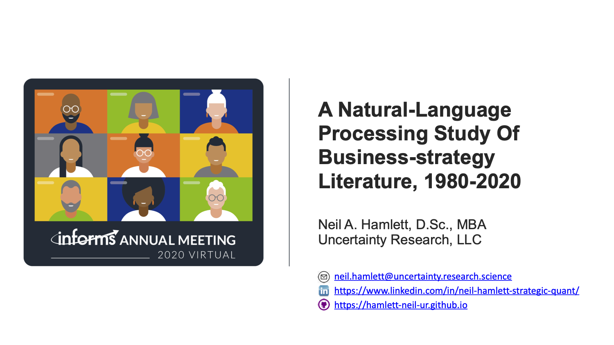

# A natural-language-processing exploration of the thematic landscape of the field of *Business Strategy*, 1980-2020.

## Abstract/Executive Summary.

A novel combination of Natural-Language Processing (NLP) and Machine-Learning (ML) techniques provides some ability to demonstrate between known-theme documents a corpus comprised of articles from a leading research journal. A presentation to the [2020 INFORMS Annual Meeting](http://meetings2.informs.org/wordpress/annual2020/) updates [previous work](https://github.com/hamlett-neil-ur/BizStratTopicAnalysis/blob/master/201229_README_old.md). The stage is set to extend results

## Motivation and Objectives.
