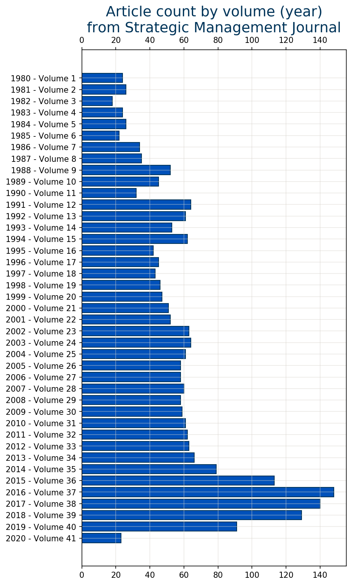

<p align="center">
 


</p>


# A natural-language-processing exploration of the thematic landscape of the field of *Business Strategy*, 1980-2020.

## Executive Summary.

### Background.  

The field of business strategy has passed through at least five three distinct identifiable themes.  Early business strategy was arguably less-strategic. It focused on operational efficiency and market-share concentration. *Scientific management*, beginning in the late 1800s, emphasized operational efficiency. This subsequently led to the fields of Operations Research and Management Science. They emphasized optimization and economies of scale. 

In the 1980's, Harvard Business School professor Michael Porter described one of the first coherent theories for business strategy.  He observed that price doesn't explain everything in marketplace competition.  Porter's paradigm focused on resources and positioning.  It also considered industry structures and balances of power between firms, their suppliers, and their customers [[Porter, 1979]](https://hbr.org/1979/03/how-competitive-forces-shape-strategy).  Substantially a microeconomic theory, it remains however largely an industrial-age view.

Clayton Christensen, one of Porter's students, described *Disruptive Innovation*.  This framework describes how unexpected, seemingly-precipitous shifts in industry structure can occur.  Christensen's view regarding overuse of the term "disruption" notwithstanding [[C. M. Christensen, *et al*, 2015]](https://hbr.org/2015/12/what-is-disruptive-innovation), it tells how "low-end" players can "eat their way up" the market.  Incumbents, focused on their most-demanding customers, are caught flat-footed as less-distinguishing customers progressively defect to the disrupter.

University of California professor David Teece introduced a competency-focused view of strategy in the early 2000s with his *Dynamic Capabilities* framework [[Teece, 2009]](https://amzn.to/3aQFeLV).  Teece observed that organizations with sustained differentiated performance were characterized by the ability to reconfigure in response to new opportunities and threats. 

The role of information and knowledge have more-recently become an important aspect of strategic differentiation. Peter Drucker observed in the early 1990s that knowledge contributed more to corporate wealth than traditional forms of capital [[Drucker, 1993]](https://amzn.to/3aQFeLV).  Technology operating models — most-visibly exemplified by Facebook, Apple, Amazon, Netflix, Google (FAANGs) — largely employ information-centric operating models.  Independent researcher Neil Hamlett formulated an operational perspective of this [[Hamlett, 2019a]](https://drive.google.com/open?id=1Cq7oM6BYrGWxmjf1bdhrdrORZnKBvLu4).

### Scope of investigation.

This study looks for evidence of distinct phases and schools of thought in the academic literature on business strategy.  It seeks to answer the question, "What dominant schools of business-strategy thought can be detected in the literature?"  We look at abstracts of titles of a number of leading business and research journals.  We seek to find distinct clusters in these corpora.  We then attempt to associate clusters with schools of thought on business strategy.

### Intended audience.

Results from this research will be of interest to academic researchers in business strategy, and to business consultants. It potentially provides the basis for a presentation to a conference by the Strategic Management Society, the Institute for Operations Research and Management Science (INFORMS), or another such group.


### Summary of results.


We apply eight *known-theme* documents to the model.  These are documents regarding which we have high confidence that they address the central business-strategy themes we identified. Some are seminal articles from researchers from whom the concepts originated. 

Each of the known-themed documents resonates with one to three topics identified by the model.  The model however fails to distinguish between some themes.  The model associates some documents from distinct themes with common topics.

The *Dynamic-Capabilities* framework provides an obvious example. The algorithm aligns it strongly to one of the key topics common to M. Porter's *Competitive-Advantage* framework.  This is mildly surprising.  Some adherents of D. Teece's *Dynamic Capabilities* distinguish themselves from Porter's way of thinking with considerable emphasis.  

This is probably explained by the limitations of the approach applied here. It is well-known that machine-learning methods, when applied to text, do pretty well with the syntactic aspects of language.  That is, they do okay with vocabulary and grammar. They do less-well with the semantic aspects of language.  

## Technical Approach.


[Uncertainty Research's](https://www.linkedin.com/company/uncertainty-research-llc/about/) (UR's) delivery method is based on the [Cross-Industry Standard Process – Data Mining](http://4.bp.blogspot.com/-0iGdZDGnLks/VDA-7DKV_NI/AAAAAAAAAEI/IqYBNniTlZA/s1600/141004%2BFormal%2BMethods%2BComparison.png) (CRISP–DM).  Figure 1 provides an overview.  This method has provided the foundations for delivery methods used by many leading technology firms, including IBM.  

UR employs CRISP–DM because it contains more-direct coupling to the business context than some more data-centric methods.  It also provides more-explicit guidance on iterativity, an inescapable part of modeling.  The following subsections summarize its employment in this project.


This project exercises a diverse set of tools and technologies. The figure to the right summarizes.  The span of this summary approximately coincides with the data-understanding through the model-evaluation phases of the CRISP-DM.

Our data sources exist in [HTML-5](https://html.spec.whatwg.org/) format on publicly-accessible websites. We *scrape* them using open-source packages in python. The python logic assembles the results for each journal into a python dictionary, and then exports tthe results to [JSON](https://www.json.org/json-en.html) files.

The *heavy lifting* is accomplished in [Apache Spark Scala](https://spark.apache.org/docs/0.9.1/scala-programming-guide.html) hosted on [databricks](https://databricks.com/). This includes typical steps using [Annotators](https://nlp.johnsnowlabs.com/docs/en/annotators) from [John Snow LABS](https://www.johnsnowlabs.com/) [spark-nlp](https://nlp.johnsnowlabs.com/) libraries. The final data-assembly and modeling itself is performed using [Apache Spark MLlib](https://spark.apache.org/mllib/). 

Interpretation and visualization are accomplished through a combination of python and Apache Spark scala.  Some heavy-lift calculations, such as Bayesian inversion and entropy calculations occur in Scala. More-pedestrian data transformations occur in python using the [Matplotlib](https://matplotlib.org/) and [Seaborn](https://seaborn.pydata.org/) packages.

### Business understanding.

We seek to identify leading themes in business strategy from the published literature. This potentially is a challenging problem.  The boundaries of the discipline are fuzzy.  Distinguishing between strategy and adjacent fields proves challenging for MBA students. 


For purposes of this study we assume five distinct themes in business strategy.  Each is associated with a distinct era.  These eras can overlap.  


**Operations research and management science**.  Business management has its roots in Scientific Management, a theory that emerged in the late-nineteenth century  [[S. J Ralston, 2012]](https://papers.ssrn.com/sol3/papers.cfm?abstract_id=1979953). The Operations-Research discipline emerged at near the end of the Second World War.  This theme fundamentally focuses on efficiency and effectiveness.  The most-efficient firms are presumed to be the most-competitive.  

**Competitive advantage**.  The competitive-advantage theme recognizes the opportunity for businesses to differentiate themselves on issues other than price. Harvard business-school professor Michael Porter (e.g., [[Porter, 1979]](https://hbr.org/1979/03/how-competitive-forces-shape-strategy), [[Porter, 1996]](https://hbr.org/1996/11/what-is-strategy)) first described the framework in the late 1980s. He emphasized industry structure.  Porter's theory provides a somewhat-static view of competitive positioning, emphasizing resources and positioning [[R. L. Martin, 2015]](https://hbr.org/2015/04/strategy-is-about-both-resources-and-positioning).  

**Disruptive innovation**.  Harvard business-school professor Clayton Christensen noticed that industry structures change more-frequently than Porter's theory might suggest.  He described a distinct mode in which industry structures can shift unexpectedly and rapidly [[C. M. Christensen, *et al*, 2015]](https://hbr.org/2015/12/what-is-disruptive-innovation).  Christensen described a phenomenon called *disruptive innovation*.  Used in contexts beyond what he attended, his model describes specific modes of rapid, unexpected shifts in industry structure.

**Dynamic capabilities**. University of California Haas Business School professor David Teece similarly observed greater dynamism in the economy than Porter's model suggest.  Approaching things from an organizational-behavioral perspective, Teece emphazises the role of organizational competency in sustained, above-market returns [[Teece, 2009]](https://amzn.to/3aQFeLV).  His organizational-competency model identifies three classes of capabilities:  Sensing, siezing, and managing threats.  Organizations whose competency portfolios are balanced across these classes tend to adapt gracefully to changes in their industries.


**Information as an asset**. Peter Drucker, father of modern business consulting, wrote during the early 1990s that, "increasingly, there is less and less return on the traditional resources: labor, land, and (money) capital. ***The main producers of wealth have become information and knowledge***" [[Drucker, 1993]](https://amzn.to/2L6OJvL).  A few years prior, Porter referred to, "The information revolution  sweeping through our economy..." [[M. E. Porter, V. E. Millar, 1985]](https://hbr.org/1985/07/how-information-gives-you-competitive-advantage). Boston Consulting Group's Martin Reeves describes "competing on the rate of learning" [[M. Reeves, K. Whitaker, 2018]](https://bcghendersoninstitute.com/competing-on-the-rate-of-learning-23e725ac433e). This resembles Teece's dynamic-capabities framework. Independent researcher Neil Hamlett describes three distinct modes of information-based competitive differentiation [[Hamlett, 2019a]](https://drive.google.com/open?id=1Cq7oM6BYrGWxmjf1bdhrdrORZnKBvLu4).

### Data understanding.

Fourteen candidate journals were initially identified.  The table below summarizes them.  That nearly every journal offers a distinct web presentation is a key consideration.  Recurring effort is required to "scrape" each journal.  

The number of  years in publication emerges therefore as a key consideration.  Journals for which only a few years of issues were available are not worth the effort to attempt.  Journals not in publication for more than five or so years were eliminated from further investigation. Their marginal contribution to the size of the corpus seemed unjustified by the required effort. 

|Candidate Journal|Years Published|Digital Accessiblity|Status|
|----|----|----|----|
|[*Strategic Management*](https://onlinelibrary.wiley.com/journal/10970266)|since 1980|Html by leading publishing firm|complete ☑️|
|[*Strategic Enrepreneurship*](https://onlinelibrary.wiley.com/loi/1932443x)|since 2007|Html by leading publishing firm|complete ☑️|
|[*Journal of Strategic Organization* (Sage)](https://journals.sagepub.com/home/soq)|since 2003|Html by leading publishing firm|complete ☑️|
|[*Business Management and Strategy*](http://www.macrothink.org/journal/index.php/bms/issue/archive)|since 2010|Less than professional-grade html|complete ☑️|
|[*International Journal of Business Strategy*](https://ijbs-journal.org/IJBS-JOURNAL/Default.aspx)|since 2007|Html since 2012; pdf prior|complete ☑️|
|[*Journal of Business Strategies*](https://www.questia.com/library/p578/journal-of-business-strategies)|since 2000|Mostly-complete html|complete ☑️|
|[*California Management Review*](https://cmr.berkeley.edu/)|Since 1970|Html since 2012; pdf prior|complete ☑️|
|[*Journal of Business Strategy*](https://www.emerald.com/insight/publication/issn/0275-6668)|since 1980|Professionally-maintained HTML|complete ☑️|
|[*Strategy Science*](https://pubsonline.informs.org/journal/stsc)|since 2016| Html by leading publishing firm|Not attempted: insufficient content 🛑|
|[*Business and Strategy Development*](https://onlinelibrary.wiley.com/journal/25723170)|since 2018|Html by leading publishing firm|Not attempted: insufficient content 🛑|
|[*Academy of Strategic Management Journal*](https://www.abacademies.org/journals/academy-of-strategic-management-journal-home.html)|since 2002|Html since 2017; pdf prior|Not attempted: insufficient html content ⚠️|
|[*Journal of Strategic Information Systems*](https://www.sciencedirect.com/journal/the-journal-of-strategic-information-systems/issues)|since 2001|Html by leading publishing firm|Not attempted: peripheral to subject ⚠️|
|[*strategy+business*](https://www.strategy-business.com/)|since 1995|Html by leading publishing firm|Pending ✳️|
|[*Harvard Business Review*](https://hbr.org/)|Since 1956|Javascript by leading publishing firm|Not attempted: insufficiently specialized ⚠️|


 

The technical chartacteristics of journals' web presence is a second consideration. HTML is the most-straightforward format in which to receive the content.  Although python's [Selenium](https://selenium-python.readthedocs.io/) package allows for harvesting of javascript content, this was used sparingly.  

The degree of specialization of the journal provides a third consideration.  The [*Journal of Strategic Information Systems*](https://www.sciencedirect.com/journal/the-journal-of-strategic-information-systems/issues) — although in publication for nearly two decades and in a straightforward html format — appears tangential to the central focus of business strategy.  Also, [*Harvard Business Review*](https://hbr.org/)'s presentation makes filtering of strategy-related content difficult.  [*strategy+business*](https://www.strategy-business.com/) in contrast offers an easy filtering approach.

The accessibility of essential attributes became a technical consideration.  Some journals — e.g., [*California Management Review*](https://cmr.berkeley.edu/) and [*Journal of Business Strategies*](https://www.questia.com/library/p578/journal-of-business-strategies)  — do not for example provide explicit fields for publication date of issues and articles. Additional work is necessary in order to derive publication dates. Also, not all journals provide keywords. 

Apart from completeness, temporal distribution of content over time becomes an issue. The figure to the right shows article count by year for [*Strategic Management*](https://onlinelibrary.wiley.com/journal/10970266), the source for a plurality of the content. The journal's peak year contained six times the number of articles compared to early years. Although unsupervised learning is our use case, imbalance in data can be a concern. [[J. H. Xue, M. Tittering, 2008]](https://www.sciencedirect.com/science/article/abs/pii/S0031320307005006) is one instance of elaboration.

### Data preparation.  

Data preparation occurs in two stages, each using a distinct technology.


🅐 **Data acquisition** is accomplished using [python 3.𝖭](https://www.python.org/).  We principally use the [Requests](https://requests.readthedocs.io/en/master/), [BeautifulSoup](https://www.crummy.com/software/BeautifulSoup/bs4/doc/), with occasional use of [Selenium](https://selenium-python.readthedocs.io/).  Python-realized logic assembles the data into a [dictionary](https://docs.python.org/3/tutorial/datastructures.html#dictionaries) data object.  This is exported into a [JSON](https://docs.python.org/3/library/json.html) file.

The image to the right contains a slice of an exemplary [JSON](https://www.json.org/json-en.html). This depiction is a screen capture from [Smart JSON Editor](http://www.smartjsoneditor.com/) for Mac OS.  The information is hierarchical in structure:  Volumes contain issues, which contain articles.  The structure here contains additional metadata attributes to facilitate data-harvesting and management.  Additionally, not all publications' web presentations conform to this hierarchy. 

🅑 **Data assembly** occurs in [Apache Spark](https://spark.apache.org/docs/0.9.1/index.html) [Scala](https://spark.apache.org/docs/0.9.1/scala-programming-guide.html) programming language.  We specifically use the `play-json_2.11` package, part of the [Play framework](https://www.lightbend.com/play-framework-part-of-lightbend-platform) for Scala-based web development. Using the [Databricks Community Edition](https://community.cloud.databricks.com/login.html) package-management procedures occur according to the platform operator's procedures for [Libraries](https://docs.databricks.com/libraries.html). 
 
The DataFrame stage is the point at which content from all sources conforms to the same schema.  The schema below shows results from the `printSchema` method for a Scala [DataFrames](https://spark.apache.org/docs/1.5.0/api/java/org/apache/spark/sql/DataFrame.html).  The dataframes from all sources are concatenated into a single DataFrame using the `.union` method.

```root
 |-- titleAbstract: string (nullable = true)
 |-- rowId: long (nullable = false)
 |-- volume: string (nullable = true)
 |-- issue: string (nullable = true)
 |-- title: string (nullable = true)
 |-- abstract: string (nullable = true)
 |-- keywords: string (nullable = true)
 |-- journal: string (nullable = true)
 |-- pubDate: string (nullable = true)
 |-- rowId: long (nullable = false)
```

Due to substantial variations in content presentation by each journal, the logic threads are distinct for each.  The table below contains an invetory of code assets employed to harvest content from each of eight publications on business strategy.  The `Journal` column indicates the source publication.  The `Harvesting` conlumn contains links to the python logic for each used to produce JSON in step 🅐.  The `Transformation` column points to the logic used during step 🅑 to transform the JSON onto Scala DataFrames employed for the LDA model.


#### Inventory of data-acquisition and -transformation code assets.

The table below lists the logic used for data acquisition and transformation.  As described above, a distinct pair of assets is used  for each journal.  The `Acquisition` assets are python logic to acquire the data from each journal.  Each produces a JSON file as its output.  

The `Transformation` assets convert the JSON files into [Spark DataFrames](https://spark.apache.org/docs/2.2.0/sql-programming-guide.html).  We use the [play framework](https://www.playframework.com/documentation/2.8.x/ScalaJson) to parse and transform the JSON file for each title/abstract source. Subsequent logic aggregates the dataframes into a single spark dataframe for LDA modeling.

|Journal|Acquisition|Transformation|Atricles Harvested|
|----|----|----|----|
|[*Strategic Management*](https://onlinelibrary.wiley.com/journal/10970266)|[200302 ☑️ Strat-Mgt Jrnl Abstracts, Titles.ipynb](https://git.generalassemb.ly/hamlett-neil-ga/GA_CAPSTONE/blob/master/Code/200302%20☑%EF%B8%8F%20%20Strat-Mgt%20Jrnl%20Abstracts%2C%20Titles.ipynb)|[200305smjJsonConversion](https://databricks-prod-cloudfront.cloud.databricks.com/public/4027ec902e239c93eaaa8714f173bcfc/7867552094985401/485701476899676/1573305797721795/latest.html)|2,695|
|[*Strategic Enrepreneurship*](https://onlinelibrary.wiley.com/loi/1932443x)|[200302 ☑️ Strat-Mgt Jrnl Abstracts, Titles.ipynb](https://git.generalassemb.ly/hamlett-neil-ga/GA_CAPSTONE/blob/master/Code/200302%20☑%EF%B8%8F%20%20Strat-Mgt%20Jrnl%20Abstracts%2C%20Titles.ipynb)|[200305stratEntrepJsonConversion](https://databricks-prod-cloudfront.cloud.databricks.com/public/4027ec902e239c93eaaa8714f173bcfc/7867552094985401/3686148604251353/1573305797721795/latest.html)|265|
|[*Journal of Strategic Organization*](https://journals.sagepub.com/home/soq)|[200228 ☑️ Strat Org.ipynb](https://git.generalassemb.ly/hamlett-neil-ga/GA_CAPSTONE/blob/master/Code/200228%20☑%EF%B8%8F%20Strat%20Org.ipynb)|[200305stratOrgJsonConversion](https://databricks-prod-cloudfront.cloud.databricks.com/public/4027ec902e239c93eaaa8714f173bcfc/7867552094985401/3686148604251380/1573305797721795/latest.html)|382|
|[*International Journal of Business Strategy*](https://ijbs-journal.org/IJBS-JOURNAL/Default.aspx)|[200304 ☑️ Int'l Jrnl Biz Strat.ipynb](https://git.generalassemb.ly/hamlett-neil-ga/GA_CAPSTONE/blob/master/Code/200304%20☑%EF%B8%8F%20Int'l%20Jrnl%20Biz%20Strat.ipynb)|[200305intJrnlBizStrat](https://databricks-prod-cloudfront.cloud.databricks.com/public/4027ec902e239c93eaaa8714f173bcfc/7867552094985401/3686148604251321/1573305797721795/latest.html)|186|
|[*Journal of Business Strategies*](https://www.questia.com/library/p578/journal-of-business-strategies)|[200303 ☑️ Jrnl Biz Strategies .ipynb](https://git.generalassemb.ly/hamlett-neil-ga/GA_CAPSTONE/blob/master/Code/200303%20☑%EF%B8%8F%20Jrnl%20Biz%20Strategies%20.ipynb)|[200306jrnlBizStrategies](https://databricks-prod-cloudfront.cloud.databricks.com/public/4027ec902e239c93eaaa8714f173bcfc/7867552094985401/1622749038708419/1573305797721795/latest.html)|168|
|[*California Management Review*](https://cmr.berkeley.edu/)|[200229 ☑️ CMR.ipynb](https://git.generalassemb.ly/hamlett-neil-ga/GA_CAPSTONE/blob/master/Code/200229%20☑%EF%B8%8F%20CMR.ipynb)|[200301cmrJsonConversion](https://databricks-prod-cloudfront.cloud.databricks.com/public/4027ec902e239c93eaaa8714f173bcfc/7867552094985401/2209751683261449/1573305797721795/latest.html)|223|
|[*Journal of Business Strategy*](https://www.emerald.com/insight/publication/issn/0275-6668)|[200220 ☑️ Jrnl Biz Strategy.ipynb](https://git.generalassemb.ly/hamlett-neil-ga/GA_CAPSTONE/blob/master/Code/200220%20☑%EF%B8%8F%20Jrnl%20Biz%20Strategy.ipynb)|[200305jrnlBizStrat](https://databricks-prod-cloudfront.cloud.databricks.com/public/4027ec902e239c93eaaa8714f173bcfc/7867552094985401/3231425191019428/1573305797721795/latest.html)|1,850|
|[*Business Management and Strategy*](http://www.macrothink.org/journal/index.php/bms/index)|[200307 ☑️ Biz Mgt and Strategy.ipynb](https://git.generalassemb.ly/hamlett-neil-ga/GA_CAPSTONE/blob/master/Code/200307%20☑%EF%B8%8F%20Biz%20Mgt%20and%20Strategy.ipynb)|[200307bizMgtStrat](https://databricks-prod-cloudfront.cloud.databricks.com/public/4027ec902e239c93eaaa8714f173bcfc/7867552094985401/1104912481376606/1573305797721795/latest.html)|177|

### Modeling.

We seek to detect latent — not specified *a priori*, not directly-observable in the data — topics in our corpus.  We also seek to estimate the strength of association between those topics and the terms.  The figure to the right conceptualizes this. We see the `Topic`, which we try and infer from the statistics of the corpus.  We explicitly know the `term`s in our corpus and the `document`s to which they belong.

 

The figure to the left conceptualizes the problem. Our *Latent Dirichlet Model* (LDA) model belongs to the family of probabilistic graphical models (e.g., [[D. Koller, N. Friedman, 2009]](https://amzn.to/2x8rOwV)). The vertices (variables) in blue-gray colors are what we capture in the model.  The brown-colored vertex — exogenous to the data — is what really interests us. 

Effectively, we have two "layers" of latent variables ([[J. C. Lohelin, 2009]](https://amzn.to/2xQbOzm)). The `topic`s inferred by the model are the first layer. These are latent groupings based on `term` and `document` attributes. Relationships between `theme`s and `topic`s are subsequently induced via means not yet described here. 

That our quantitative model doesn't directly estimate what interests us happens frequently in modeling [[M. Wallace, 2020]](https://rss.onlinelibrary.wiley.com/doi/10.1111/j.1740-9713.2020.01353.x).  Data we apply to our models are *measurements*.  In general, measurements are representations of some underlying phenomenon, referred to in measurement theory as *measurands* [[S. Salicone, M. Prioli, 2018]](https://www.springer.com/us/book/9783319741376).  Measurements only very rarely represent their associated measurands with perfect fidelity. Modelers do well to pay heed to this.

Our statistical model infers the from the `term`s and `documents` associations with `topic`s, the quantity of which is selected by the modeler. The strength of each association is quantified by *conditional probabilities* 𝒫𝓇{Term|Topic} and 𝒫𝓇{Document|Topic}.  We assume that a `topic` *generates* documents and terms.  This kind of model is called a *generative model*.

*Latent Dirichlet Allocation* (LDA) is one modeling approach commonly employed for this. This approach was first described in [[D. M. Blei, *et al*, 2003]](http://www.jmlr.org/papers/volume3/blei03a/blei03a.pdf) from a group of Stanford University Professors.  Its terms have significance.  It is called:

⓵ **Latent**, because the `Topic`, the variable of interest is not directly observable;

⓶ **Dirichlet**, after the [Dirichlet distribution](https://en.wikipedia.org/wiki/Dirichlet_distribution) that describes the probabilities of the association; and

⓷ **Allocation**, because we allocate our probability relationships across all `Topic`s, as opposed to fixing a `Document` or `Term` to a specific document.  

We use the [spark.apache.org Machine-Learning library's](https://spark.apache.org/docs/latest/ml-guide.html) [Class LDA](https://spark.apache.org/docs/latest/api/java/org/apache/spark/ml/clustering/LDA.html) package to perform our calculations.

#### Pattern for model development.

We use a [Databricks](https://databricks.com/) demonstration "[Topic Modeling with Latent Dirichlet Allocation](https://databricks-prod-cloudfront.cloud.databricks.com/public/4027ec902e239c93eaaa8714f173bcfc/3741049972324885/3783546674231782/4413065072037724/latest.html)" as our starting point.  Our realization at [200401stratLitLDA — 🌟spark-nlp](https://databricks-prod-cloudfront.cloud.databricks.com/public/4027ec902e239c93eaaa8714f173bcfc/7867552094985401/806015918131305/1573305797721795/latest.html) is described in the following.  We include references to three sources.  The Spark Machine-Learning Library Guide [MLib: Main Guide](https://spark.apache.org/docs/latest/ml-guide.html), the Scala [API description](https://spark.apache.org/docs/latest/api/scala/index.html#org.apache.spark.package), and the documentation for the [Spark Apache package library](https://spark.apache.org/docs/2.1.1/api/java/overview-summary.html).  


##### Data assembly.

In anticipation of subsequent GridSearch, we instantiate our model as a [`org.apache.spark.ml.Pipeline`](https://spark.apache.org/docs/latest/ml-pipeline.html). Our pipeline stages consist of all of the functions in the [Transformers](https://nlp.johnsnowlabs.com/docs/en/transformers) [Annotators](https://nlp.johnsnowlabs.com/docs/en/annotators) from [spark-nlp](https://www.johnsnowlabs.com/).  We perform a straightforward transformation of the pipeline output to make the format compatible with [`CountVectorizer`](https://spark.apache.org/docs/latest/api/scala/index.html#org.apache.spark.ml.feature.CountVectorizer).  Our gridsearch parameter space will span parameters for [`CountVectorizer`](https://spark.apache.org/docs/latest/api/scala/index.html#org.apache.spark.ml.feature.CountVectorizer) and [`org.apache.spark.ml.clustering.LDA`](https://spark.apache.org/docs/latest/api/scala/index.html#org.apache.spark.ml.clustering.LDA).

The construction of our annotation `Pipeline()` follows the following steps. We are using the [Transformers](https://nlp.johnsnowlabs.com/docs/en/transformers) [Annotators](https://nlp.johnsnowlabs.com/docs/en/annotators) from [`spark-nlp`](https://www.johnsnowlabs.com/). 

⓵ The spark-nlp [`DocumentAssembler`](https://nlp.johnsnowlabs.com/docs/en/transformers#documentassembler-getting-data-in) is the first step.  Its API documentation is [`DocumentAssembler`](https://nlp.johnsnowlabs.com/api/#com.johnsnowlabs.nlp.DocumentAssembler). 

⓶ The [`SentenceDetector`](https://nlp.johnsnowlabs.com/docs/en/annotators#sentencedetector) comes next.    

⓷ As usual, our sentences are decoposed into tokens by the [`Tokenizer`](https://nlp.johnsnowlabs.com/docs/en/annotators#tokenizer).  The datailed API is [`Tokenizer`](https://nlp.johnsnowlabs.com/api/#com.johnsnowlabs.nlp.annotators.Tokenizer). 

⓸ We next use the [`Stemmer`](https://nlp.johnsnowlabs.com/docs/en/annotators#stemmer).  Its API is at [`Stemmer`](https://nlp.johnsnowlabs.com/api/#com.johnsnowlabs.nlp.annotators.Stemmer).  This proves somewhat of a klunky way to truncate suffixes.  We prefer the [`Lemmatizer`](https://nlp.johnsnowlabs.com/docs/en/annotators#lemmatizer), with API [`Lemmatizer`](https://nlp.johnsnowlabs.com/api/#com.johnsnowlabs.nlp.annotators.Lemmatizer).  This requires a dictionary.  A pretrained Lemmatizer is apparently available as a [`PretainedModel`](https://github.com/JohnSnowLabs/spark-nlp-models).  Its use is not altogether clear.  We therefore go with the `Stemmer` for now.

⓹ Asembling stemmed tokens into Ngrams is our final data-assembly step. The [`NGramGenerator`](https://nlp.johnsnowlabs.com/docs/en/annotators#ngramgenerator), with API [`NGramGenerator`](https://nlp.johnsnowlabs.com/api/#com.johnsnowlabs.nlp.annotators.NGramGenerator) serves this purpose. The `setEnableCumulative` represents its primary advantage over the [`org.apache.spark.ml.feature.NGram`](https://spark.apache.org/docs/latest/api/scala/index.html#org.apache.spark.ml.feature.NGram) transformer.  This obviates the need to concatenate tranformer outputs.  

After stage ⓹, we have a corpus of slightly more than 5,500 documents. Collectively, the contain a little bit more than 1.275 million terms.

⓺ One more step is needed to convert the spark-nlp output into a structure compatible with [`CountVectorizer`](https://spark.apache.org/docs/latest/api/scala/index.html#org.apache.spark.ml.feature.CountVectorizer). Tokens coming out of `spark-nlp` are wrapped in additional metadata we do not need for our LDA model. The schema is reproduced below.

All [`CountVectorizer`](https://spark.apache.org/docs/latest/api/scala/index.html#org.apache.spark.ml.feature.CountVectorizer) needs is the `result` attribute. This *Munging data* article  [Working with Spark ArrayType columns](https://mungingdata.com/apache-spark/arraytype-columns/) gives us a pattern to reshape our dataframes.  We use a twist on this.  

Specifically, we use 
      ```stratLitNgrams.select(col("volIssueTitleHash"),
                               col("nGrams.result").as("token"))```
method.  The `result` attribute is the `token` we need to feed the `import org.apache.spark.ml.feature.CountVectorizer()` transformer needs.  We colect this final result in a dataframe.    

##### Model-matrix analysis.

Now, LDA is effectively a type of clustering method.  We score such algorithms based on combinations of *separation* and *cohesion*.  Although what do with LDA differs from k-Means clustering, the same concepts apply.  We discriminate classes based on member distances within each clas and on distances between adjacent classes.

Fundamentally based on Euclidian geometery, dimensionality arises as a concern. We ideally seek to avoid "scanning" over dimensions that do not discriminate between class membership.  We want to focus our attention on dimensions that do.

 


[Singular-value decomposition](http://web.mit.edu/course/other/be.400/OldFiles/www/SVD/Singular_Value_Decomposition.htm) gives us a way to tell how-important each dimension in our feature space is [[Golub, 1989, §8.3]](https://amzn.to/2VHuzNT), [[Horn, 1985, §7.3.5]](https://amzn.to/3aoWdEP). The figure to the right gives us the singular-value spectrum of the token-count features for an exemplary model matrix for our corpus.  Singular values tell us how much variation is associated with each dimension in the token-count feature space. 

Despite apparance, this feature space is not very dimensionally-dominated. Two visualizations inform us about this. First, the largest and smallest singular values differ by a factor of a little bit more than an order of magnitude. Their ratios are less than twenty.  We see that the ratios of the consecutive singular values are a little bit more than unity.  The exception is the ratio of the first to the second, which is a factor of two.

We also find that 90% of the overall variance spans about 270 of 450 total dimensions.  We need around 340 dimensions to capture 95% of the overall variance. The the potential for dimensionality reduction is modest.


#### Topic analysis: Latent-Dirichlet Allocation (LDA) Modeling.

The LDA-modeling approach was first described by [[Blei, *et al*, 2003]](http://www.jmlr.org/papers/volume3/blei03a/blei03a.pdf).  It emerged as a powerful, widely-used method for content classification.  Spark provides LDA modeling through its [[Class LDA]](https://spark.apache.org/docs/latest/api/java/org/apache/spark/mllib/clustering/LDA.html) package.  A DataBricks primer [Topic Modeling with Latent Dirichlet Allocation](https://databricks-prod-cloudfront.cloud.databricks.com/public/4027ec902e239c93eaaa8714f173bcfc/3741049972324885/3783546674231782/4413065072037724/latest.html) provides a clear, concise demonstration of its application.

The analysis involved a *manual* grid-search of metaparameters believed to be influential to model performance. Spark does offer a [CrossValidator](https://spark.apache.org/docs/latest/api/scala/index.html#org.apache.spark.ml.tuning.CrossValidator).  It requires however an `evaluator` class, for which none for LDA is available.  Also, since LDA is an unsupervised approach, cross-validation does not necessarily even apply.

The Spark [[Class LDA]](https://spark.apache.org/docs/latest/api/java/org/apache/spark/mllib/clustering/LDA.html) package requires us to specify three things at a minimum. We first, indicate `K`, the number of clusters.  Unlike methods such as DBSCAN — for which  third-party Scala package packages are  available — the quantity of topics must be specified exogenously.

We also specify an `optimizer`. Our approach specified the `em`, for *Expectation Maximization* (EM) method. EM is commonly employed in mixture and latent-class modeling (e.g., [[G. McLachaln, D. Peel, 2000]](https://amzn.to/334Gqst), [[S. Frühwuirth-Schnatter, 2006]](https://www.springer.com/us/book/9780387329093), [[A. Agresti, 2013, §14.1]](https://amzn.to/2wETrNo)).  The EM calculation specifically tries to associate documents in our corpus with *latent* — not-directly observed — classes. We also specify maximum number of iterations for the EM algorithm's convergence.

Our "manual" grid search looks at variation of the LDA model's performance with respect to four meta-parameters:

⧐ The number of latent classes, or clusters;

⧐ The size of the vocabulary produced by the [CountVectorizer](https://spark.apache.org/docs/latest/api/scala/index.html#org.apache.spark.ml.feature.CountVectorizer);

⧐ Other count-vectorizer parameters such as minum and maximum number of different documents a term could appear in to be included in the vocabulary, adnd the minimum appearance of a word in a document; and

⧐ The contents of the stopwords list.

We seek the grid point providing the smallest perplexity.  This is consistent with EM mdeling for conventional mixture modeling (e.g., [[S. Frühwuirth-Schnatter, 2006, §2.3.2]](https://www.springer.com/us/book/9780387329093)).  We searched 180 points.  Once the stop-words list stabilized, the maximum likelihood occurred for cluster count $K = 10$, vocabulary size $N=400$, and maximum document frequency $DF_\mathrm{max} = 0.75$.


#### Inventory of LDA-modeling code assets.

The table below summarizes the [Apache Spark](https://spark.apache.org/) used for the LDA modeling itself.

|Asset|Description|
|----|-----|
|[Grid-Search](https://databricks-prod-cloudfront.cloud.databricks.com/public/4027ec902e239c93eaaa8714f173bcfc/7867552094985401/806015918131357/1573305797721795/latest.html)|Performs grid-search over hyper-parameter space for the [spark-nlp](https://nlp.johnsnowlabs.com/) [`NGramGenerator`](https://nlp.johnsnowlabs.com/api/#com.johnsnowlabs.nlp.annotators.NGramGenerator), and the [`classCountVectorizer`](https://spark.apache.org/docs/2.2.0/api/scala/index.html#org.apache.spark.ml.feature.CountVectorizer) and the [`LDA`](https://spark.apache.org/docs/2.2.0/api/scala/index.html#org.apache.spark.ml.clustering.LDA) from the [Apache MLLib](https://spark.apache.org/mllib/) machine-learning library.  We search over `N`, the minimum-length N-Gram; `vocabSize`, the maximum size of vocabulary; and `K`, the number of latent topic clusters.  We search for the best `logPerplexity` score from the [`DistributedLDAModel`](https://spark.apache.org/docs/2.2.0/api/scala/index.html#org.apache.spark.ml.clustering.DistributedLDAModel).|
|[Model-Evaluation](https://databricks-prod-cloudfront.cloud.databricks.com/public/4027ec902e239c93eaaa8714f173bcfc/7867552094985401/806015918131305/1573305797721795/latest.html)|Given results from grid-search, this code fits the data to the optimum parameter set.  Additional entropy-related statistics are calculated to understand the strength of association of documents, terms to topics. A visualization from the DataBricks primer [Topic Modeling with Latent Dirichlet Allocation](https://databricks-prod-cloudfront.cloud.databricks.com/public/4027ec902e239c93eaaa8714f173bcfc/3741049972324885/3783546674231782/4413065072037724/latest.html) is constructed. This logic also transforms known-theme documents using the trained LDA model to produce allocations of 𝒫𝓇{`Topic` ∣ `Document`}. |


### Model evaluation.


We identified eight documents known to correspond the the key themes we seek to identify. The table to the right delinates them.  These documents are mostly from key researchers who originated the frameworks associated with the themes. 

For example, *Competitive Advantage* was developed by Harvard Business School professor Michael Porter during the 1980s. Clayton Christensen, one of his students, first described the *Disruptive Innovation* concept. University of California professor David Teece originated the *Dynamic Capabilties* framework.

When article abstracts were available, we use those.  Otherwise, we judiciously select abstract-length passages that concisely articulate the key ideas each theme. Since we train the model with titles and abstracts, we want these documents to be of similar length.


The figure to the left depicts a heat map of the belief allocated by the LDA algorithm to each topic for each document.  In terms of conditional probabilities, these are 𝒫𝓇{Topic | Document}.  We show the allocations for each known-theme document. 

At least three observations are noteworthy.  The *signal strength* is the first. For a relatively strong association, the largest allocated belief is on the order of 0.15.  

We can use entropy to quantify this.  If we define conditional entropy as

<p align="center">

</p>

where *K* is the number of topic clusters, then the results above correspond to entropies in neighborhood of 0.975.  The preponderance of the nearly 6,000 documents end up with entropies in this neighborhood. This model does not give us seemingly-strong signals.


Second, each of the known-theme documents does produce a relatively strong signal for at least one topic.  We assume a *significant* signal for a 𝒫𝓇{Topicᵥ | Document} ≳ 0.125. Some known-theme documents actually produce significant signals for two to three topics.  


Third, some documents from different known themes produce signals for the same topic.  For example, [[Christensen2015]](https://hbr.org/2015/12/what-is-disruptive-innovation) produces a very strong signal for Topic 5, the same topic for which the strongest signal for [[Porter1996]](https://hbr.org/1979/03/how-competitive-forces-shape-strategy) occurs. Similarly, both [[Drucker1993]](https://amzn.to/3dpLbAK) and [[Hamlett2019]](t.ly/qO7i) produce string signals for Topic 4, which is the strongest topic for [[Teece1997]](https://bit.ly/2WdMMnT). We cannot always distinguish between themes of known-theme documents.


### What do we believe is happening here?

When we introduced LDA modeling above, we called particular attention particular attention to the point that the *measurements* applied to our model are distinct from the *measurands* in which we are actually interested.  Specifically, we are interested in `theme`s.  Our model produces `topic`s.

What's the difference?  Computational linguistics in general capture language only incompletely [[R. Hausser, 2014]](https://www.springer.com/us/book/9783642414305). We think of linguistics in terms of *semantics* and *syntax*.  *Semantics* referrs to the meaning of a piece of text.  *Syntax* includes its vocabulary and grammar.

Now, our [Annotators](https://nlp.johnsnowlabs.com/docs/en/annotators) work solely on the basis of syntax.  In this present iteration, we lean heavily on vocabulary.  We introduce grammar to the limited extent that we use [`NGrams`](https://nlp.johnsnowlabs.com/docs/en/annotators#ngramgenerator).  It is intended in subsequent work to introduce more-extensive grammar into the model.

This means that we can only infer semantics from syntax if there is an unambiguous relationship between the two.  That is, we can distinguish two distinct themes by their syntax *if and only if* their vocabulary and grammar are substantially distinct.  We cannot distinguish themes of they make extensive use of a common vocabulary and grammar.


 

We see lots of overlap in topic `4` for example between three themes:  *Competitive advantage*, *Dynamic capabilities*, and *Information as an asset*.  The litearature for these themes apparently make extensive use of the same vocabulary. We do not therefore have a one-to-one association between topics and themes.

***What might we do about this?***  Fortunately, the allocations across topics for the known-theme documents are not distinct.  A stronger thematic classifier might make use of a second stage of modeling.  

The figure to the left illustrates.  We observed that the LDA model itself belogs to the family of probabilistic graphical models [[D. Koller, N. Friedman, 2009]](https://amzn.to/2x8rOwV). We can extend this paradigm graphically.  We need to specify a set of conditional probabilities  to accomplish this.  

Now, This is unlikely to provide a perfect classifier. Also, how to get our s requires additional thought.  Recognizing however that our LDA model does not in this case provide our final result is the key point, here.

   
## Further directions. ([INFORMS Annual Meeting](http://meetings2.informs.org/wordpress/nationalharbor2020/),  November 8-11, 2020).

⓵ **Quantitative model evaluation**. Evaluation to to date focused on entropy analyis.  [[Blei, *et al*, 2003]](http://www.jmlr.org/papers/volume3/blei03a/blei03a.pdf) describes a *perplexity* statistic.  Perplexity somewhat resembles entropy, in that it calculates log-probabilities. The senimal paper also describes analysis resembling cross-validation.  We explore some of these methods.


⓶  **Corpus expansion**.  The corpus in this analysis is limited to article titles and abstracts. We seek to expand our corpus to full-text articles. This likely reduces the number of journals.  The total volume of text is however expanded by multiples.

⓷ **Temporal analysis**. Our dominant business-strategy themes are associated with distinct eras in time. We visualize the concentrations of topics over time.  We use document publication dates for our temporal variable.  A *violin plot*, a box plot based on kernel-density estimates, seems a likely visualization.

_____
_____
_____

    
    
